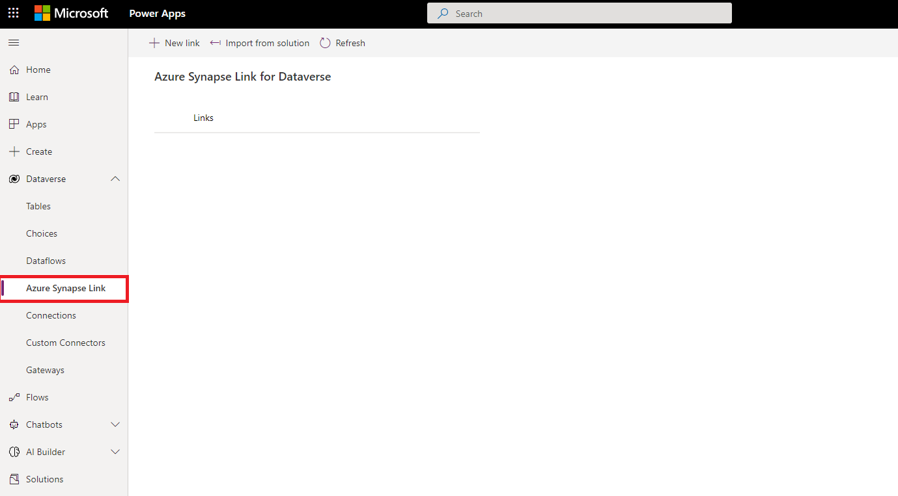
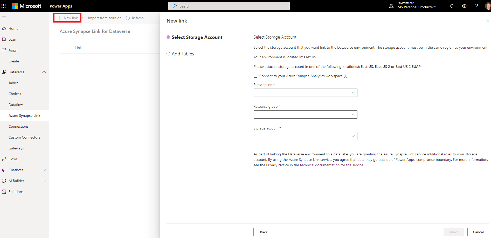
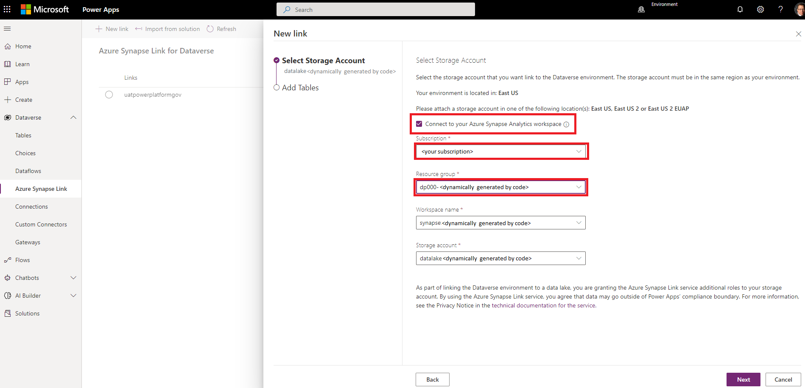

---
lab:
    title: 'Use Azure Synapse Link for Dataverse'
    module: 'Use Azure Synapse Link'
---

# Use Azure Synapse Link for Dataverse

Azure Synapse Link for Dataverse enables you to automatically synchronize a structure in dataverse  with a dedicated SQL pool in Azure Synapse Analytics. This synchronization enables you to perform low-latency analytical workloads in Synapse Analytics without incurring query overhead in the source operational database.

This lab will take approximately **35** minutes to complete.

## Before you start

You'll need an [Azure subscription](https://azure.microsoft.com/free) in which you have administrative-level access.

You'll need to setup or have access with appropriate permissions to a Dataverse Table which can be accomplished by using the [Create tables in Dataverse module.](https://docs.microsoft.com/en-us/learn/modules/get-started-with-powerapps-common-data-service/)

## Provision Azure resources

In this exercise, you'll synchronize data from an Azure SQL Database resource to an Azure Synapse Analytics workspace. You'll start by using a script to provision these resources in your Azure subscription.

1. Sign into the [Azure portal](https://portal.azure.com).
2. Use the **[\>_]** button to the right of the search bar at the top of the page to create a new Cloud Shell in the Azure portal, selecting a ***PowerShell*** environment and creating storage if prompted. The cloud shell provides a command line interface in a pane at the bottom of the Azure portal, as shown here:

    

    > **Note**: If you have previously created a cloud shell that uses a *Bash* environment, use the the drop-down menu at the top left of the cloud shell pane to change it to ***PowerShell***.

3. Note that you can resize the cloud shell by dragging the separator bar at the top of the pane, or by using the **&#8212;**, **&#9723;**, and **X** icons at the top right of the pane to minimize, maximize, and close the pane. For more information about using the Azure Cloud Shell, see the [Azure Cloud Shell documentation](https://docs.microsoft.com/azure/cloud-shell/overview).

4. In the PowerShell pane, enter the following commands to clone this repo:

    ```
    rm -r dp-000 -f
    git clone https://github.com/MicrosoftLearning/mslearn-synapse dp-000
    ```

5. After the repo has been cloned, enter the following commands to change to the folder for this lab and run the **setup.ps1** script it contains:

    ```
    cd dp-000/Allfiles/Labs/08
    ./setup.ps1
    ```

6. If prompted, choose which subscription you want to use (this will only happen if you have access to multiple Azure subscriptions).
7. When prompted, enter a suitable password for your Azure SQL Database.

    > **Note**: Be sure to remember this password!

8. Wait for the script to complete - this typically takes around 15 minutes, but in some cases may take longer. While you're waiting, review the [What is Azure Synapse Link for Dataverse?](https://docs.microsoft.com/en-us/power-apps/maker/data-platform/export-to-data-lake) article in the Azure Synapse Analytics documentation.

## Configure Storage Account for Owner Access ##
> **[!IMPORTANT]**
> The system administrator in your organization should determine and assign appropriate permissions to create and update dataverse tables with Synapse storage accounts. This is for demonstration purposes and assumes you have appropriate permissions to *add user* to your **role assignments**

1. Navigate back to your portal and open the resource group that was created for you.
2. In the Resource group, select the data lake within the resource group.


3. Next, select **Access Control (IAM)** in the left pane of the portal. If your pane isn't showing, select on the &#9776; icon in the top left of the portal, which appear as three horizontal lines.


4. Next, we need to *add a role assignment*, by clicking the **+Add** button and then selecting **Add Role Assignment**.


5. In the **Add Role Assignment** blade, select the **owner** under the column **name** and then select **Next**.


6. On the next blade within **Add Role Assignment** you'll see a blade named, **Select Members**. Type in the email address that you were assigned and will be using in PowerApps to establish the connection between Synapse and Dataverse.


## Provision Dataverse Resource

In this exercise we're going to connect to the synapse instance and storage account in the resource group we just created. 
> **[!IMPORTANT]**
> The system currently requires you to setup your **storage accounts** in the same region as your O365 Service which may impact your ability to complete  this portion of the lab.

1. Sign into [PowerApps](https://make.preview.powerapps.com/)
2. Expand the Dataverse section:


3. Select the **Select Synapse Link**.



4. select **New Link**.



5. select the button under *Select Storage Account* named **Connect to your Azure Synapse Analytics Workspace**.
6. In the drop-down under *Subscription*, select the subscription you provisioned the Azure Resources.
7. In the drop-down under *Resource Group*, select the resource group that starts with **dp000-** 
   
> [!NOTE]
> You can refer to the powershell output for the full name of the randomly generated number.

8. Once you select the *Resource Group*, you should see the *Workspace name* and *Storage account* populate automatically.
   


9. The next step is to select the table to link, if you followed the directions from the pre-requesites, you will have a *Pet Name* table, select this table and then click **Save**


## Query the Dataverse table in Synapse Analytics ##

1. If not already done, Sign into the [Azure portal](https://portal.azure.com).
2. Navigate to the resource group that you've been working with and select your Synapse instance in the Resource Group list.
> [!NOTE]
> You will likely be prompted for your credentials which should be cached. Be sure to enter the credentials that you have used to set everything up.


3. Select the Data icon in the left pane.


4. In the **Data** blade, expand the **Lake database**.
5. Expand the **dataverse_<your assigned key>** database.
6. Expand the **tables** which will display the dataverse tables that have been replicated to Synapse.


7. By mousing over the <systemid>_petname table you will see an elipses (...) on the right-hand side
8. select ***New SQL Script***, then ***Select TOP 100 rows***


9. Select **Run**.


> [!NOTE]
> You will see all of the records including auditing records for the table that you created in the Dataverse Creation Exercise.
> 

## Delete Azure resources ##

If you've finished exploring Azure Synapse Analytics, you should delete the resources you've created to avoid unnecessary Azure costs.

1. Close the Synapse Studio browser tab and return to the Azure portal.
2. On the Azure portal, on the **Home** page, select **Resource groups**.
3. Select the **dp000-*xxxxxxx*** resource group that was created by the setup script at the beginning of this exercise.
4. At the top of the **Overview** page for your resource group, select **Delete resource group**.
5. Enter the **dp000-*xxxxxxx*** resource group name to confirm you want to delete it, and select **Delete**.

    After a few minutes, your resource group and the resources it contained will be deleted.

